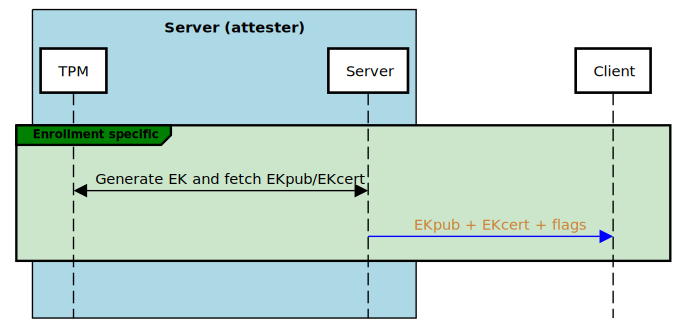

# Ulrablue protocol

Several protocols has been seen in the wild to perform remote attestation, but there is no standard yet. Ultrablue comes with its own protocol, which we do not claim to be the best, but we tried at least to document it well.

It is divided into several steps, listed here. For each, there is a sequence diagram showing what it does, following by an explanation of how it works, and why we do it this way. At the end of the document is the full diagram of the merged steps.

# Protocol steps:

## Enrollment - Pairing


When running the server in enroll mode, this one will generate a long-term symmetric key from the TPM random source. This key will be used to encrypt all subsequent communications with the enrolling client.

It will then display display the key, and connection information it in a QR code, so that the client can connect to the server over Bluetooth. This connection information is currently the MAC address of the server, but as IOS doesn't allow us to search Bluetooth devices by MAC address, maybe this will evolve. A possible thing would be to generate a random PIN, on server side, display it on the QR code, and advertise something like `ultrablue-XXXX` as the server name.

Once the client scanned the QR code and possess connection & encryption materials, it generates a random UUID. This UUID will identify the client to the server, allowing to fetch the encryption key on later attestations for the same client.

## Authentication

While this step isn't technically needed (the encryption is already authenticated), it avoids an attacker to trigger heavy TPM calls from next steps. TPMs are not all equals, and results may vary on other machines, but on mine, it can take up to 10s to create an attestation key, while the authencication step takes at most 200ms.


It starts with the client sending its UUID to the server. It allows the server to persist the newly generated key for an enrollment, or to retrieve it during an attestaion.

The server then generates a random nonce, and sends it to the client (encrypted with the shared key, and a random IV). The client must then decrypt the nonce - assuming it knows the shared key - tweak it, encrypt it with the shared key and a newly generated IV, and send back the result.

The nonce must be tweaked for a simple reason: If the server only expects the same nonce to be reencrypted, an attacker could get the encrypted nonce, and immediately send it back unchanged, without even decrypting it. (It would be the same nonce, encrypted with the right key, and prefixed with a valid IV).
Another solution would be to check on server side that the IV changed, but we choosed the nonce tweak approach.

Concretely, the expected tweak is the following (in python):
```python
tweaked = nonce[8:] + nonce[:8]
```
It consists in splitting the nonce in two halfs, and invert them.

Once the client sent back the tweaked nonce, the server can match it with the nonce it sent (thus also performing the tweak itself). If they match, the client is now able to continue. If they don't, the client is disconnected.

## Enrollment - EK exchange

For subsequent attsetations, the client must know the public part of the attester's TPM Endorsement Key.
This step aims at communicate it to the client.



The server first generates its Endorsement Key with the TPM. The Endorsement Key is deterministically generated from a seed and a template. The seed is burnt into the TPM and never changes. The template is application provided, and Ultrablue always provide the same, this results in the same EK each time, and only avoids keeping the EK in the TPM persistent memory.
If present, a certificate for the Endorsement key is also fetched. Certificates for the most freqent templates are stored into the TPM non volative memory.

The EK and its certificate (if found) are send to the client. In this message, a flag is also sent to indicate to the client weither or not it will be used to do disk decryption. The flag will be set if the server was run with the `--pcr-extend` command line argument.

If this flag is set, the client needs to generate a secret at some point during the enrollment, and send it to the server as the attestation response on each attestation success, as well as at the enrollment end.
This secret will be used by the server to extend the 9th PCR, which can then be used to do disk dectyption.

## Credential activation

For privacy reasons, the Endorsement Key can't sign anything. Remote attestation protocols however requires a singing key coming from the TPM. This is the goal of the Attestation Key.
The credential activation step aims at providing this key to the client, and proving it this key is genuine.


First, the server generates an attestation key on the TPM. This key is derived from the Storage Root Key, and is per-attestation unique. It then sends what we call the AK name to the client, which is the public part of the key, and the template used to create it.

At this point, the user will create a challenge, encrypting the AK name, and a secret it just generated to the Endorsment Key public it knows from the enrollment. This process is known as the [MakeCredential](https://tpm2-tools.readthedocs.io/en/latest/man/tpm2_makecredential.1/) step.

The resulting blob is sent to the server, and this one will call the [ActivateCredential](https://tpm2-tools.readthedocs.io/en/latest/man/tpm2_activatecredential.1/) TPM function. The specification states that the TPM will decrypt and return the original challenge secret if and only if the wrapped AK name has been generated on the same TPM.

If the server is able to send back the decrypted secret, and if it matches the one the client generated, the AK can be trusted for the rest of the protocol.

## Attestation

This is the step where we actually check the boot state measurements against reference ones.


It begins with the client generating an anti replay nonce. This nonce aims to avoid replay-attacks. This nonce is sent to the server.

The server then asks the TPM to generate a *quote*. A quote basically contains the final digests of each PCR, and the anti-replay nonce. The whole thing is signed to the AK priv.

The server also fetch the event log, which is a big file, stored in memory, and containing very descriptive information about each PCR event that occured during the boot of the server machine. Unfortunately, this event log isn't signed and can't be trusted at this point.

Anyway, the server sends the quote and the event log to the client, at which point it'll have several very important things to do:
- Check the quote signature
- Check the signed anti-replay nonce
- Apply the PCR policy: During an attestation, it means comparing new PCR values from the quote, with reference ones. During the enrollment, those PCRs values are directly stored; This is a trust on first use model. Note that one is not forced to check each PCR: This choice can be left to the user.
- Optionally replay the event log, which can be useful in case of error to provide a diagnostic to the user.

Finally, the client must return a response. This response can indicate an error, and must return the secret generated at enroll time if the server command line flag `--pcr-extend` was provided.

# All-in-one protocol

Put all together, this is what our protocol looks like. Feel free to contact us if you see anything to say about it, any suggestion/improvement...


---

# What's next?

The following are ideas on how we could improve the protocol, some have already be approved, yet not implemented. Others are just ideas and will stay here for now.

## Nonces merging

The idea is that between the credential activation and the attestation process, two nonces are generated on client side, used on server side and verified again on client side.
We could merge those nonces in this way:


The only remaining nonce is the MakeCredential one, that is also used as the anti-replay nonce given to the TPM to generate the quote.
